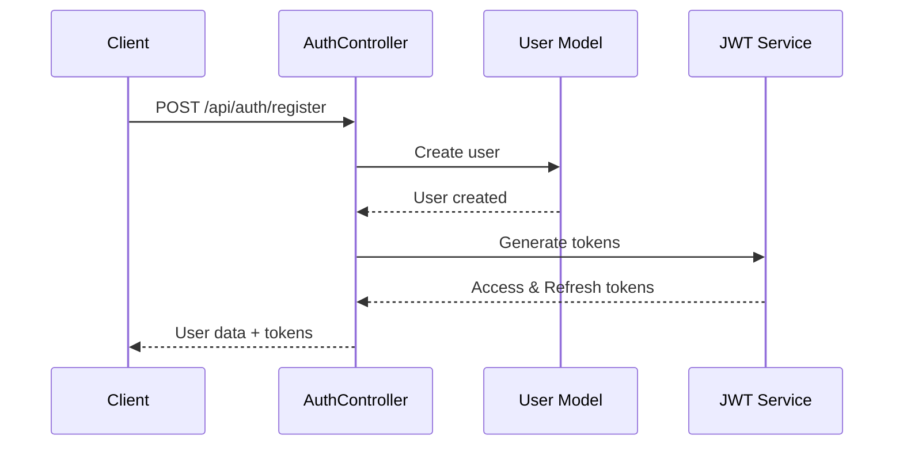
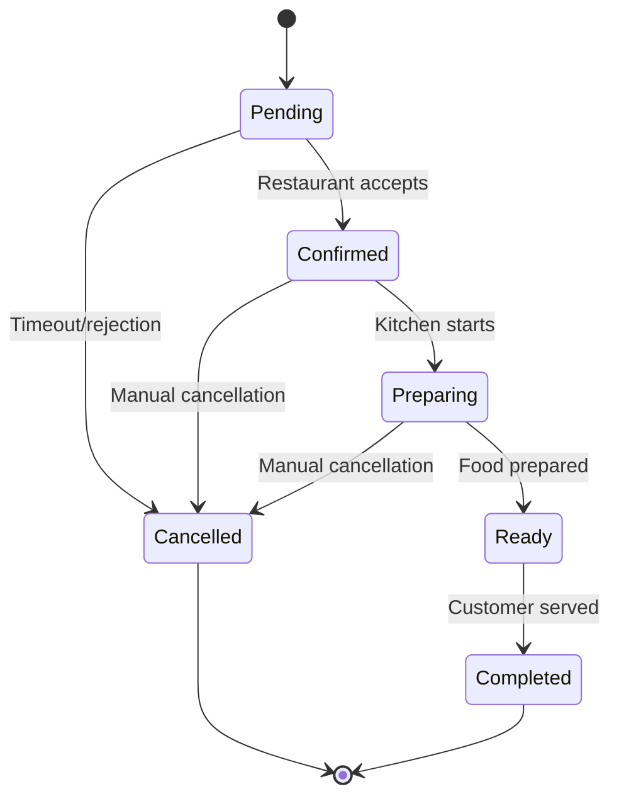
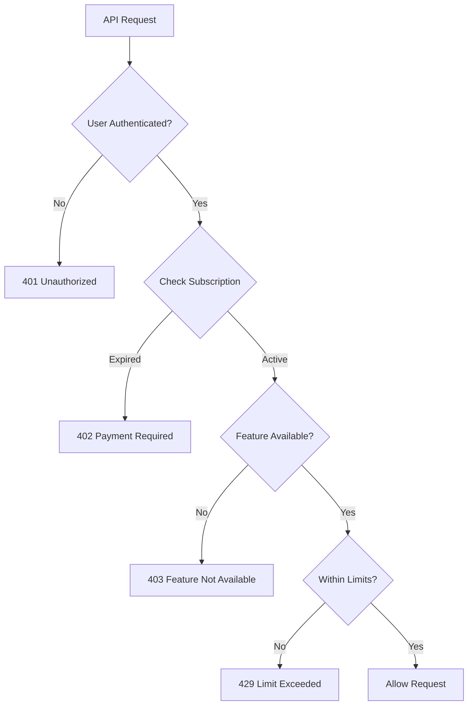
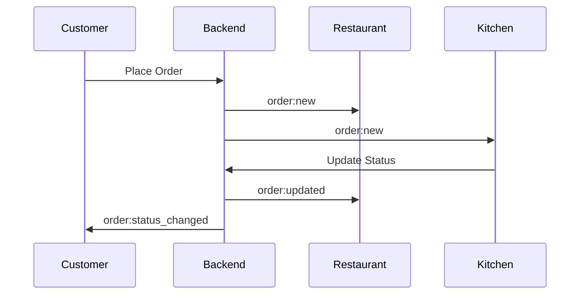
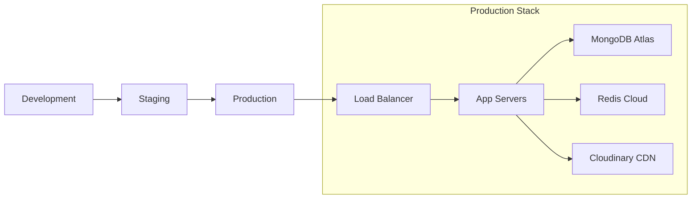

# TableServe Backend Implementation Completion Plan

## Overview

This document completes the remaining implementation tasks for the TableServe backend after the API Endpoints Structure section. It covers controller implementations, authentication middleware, business logic services, real-time features, testing strategy, and deployment configuration.

## Architecture Summary

TableServe is a multi-tenant QR-based restaurant ordering platform with:
- **Node.js + Express.js** backend
- **MongoDB Atlas** for data persistence
- **Redis** for caching and sessions  
- **Socket.io** for real-time updates
- **JWT** authentication with role-based access control
- **Cloudinary** for image management

## Controller Implementation

### Authentication Controller



**Key Features:**
- User registration with role assignment
- Password hashing with bcrypt (12 salt rounds)
- JWT token generation (15min access, 7day refresh)
- Email/phone uniqueness validation
- Comprehensive error handling

### Restaurant Management Controller

**Operations Supported:**
- Create/Read/Update/Delete restaurants
- Table management with QR generation
- Menu category and item CRUD
- Subscription limit enforcement
- Image upload integration

**QR Code Generation:**
- Standard QR codes for basic plans
- Custom QR codes with logo/branding for premium plans
- Table-specific QR codes
- Bulk QR generation for multiple tables

### Order Processing Controller



**Features:**
- Real-time order status updates
- Menu item availability validation
- Modifier price calculations
- Order total computation with tax
- Customer notification system

## Authentication & Authorization Middleware

### JWT Authentication Middleware

```javascript
// Authentication flow
const authMiddleware = async (req, res, next) => {
  // Extract JWT from Authorization header
  // Verify token signature and expiration
  // Load user data and subscription info
  // Attach user to request object
  // Handle token refresh if needed
};
```

### Role-Based Access Control (RBAC)

**Permission Matrix:**

| Feature | Super Admin | Restaurant Owner | Zone Admin | Zone Shop | Zone Vendor |
|---------|-------------|------------------|------------|-----------|-------------|
| User Management | ✅ | ❌ | ❌ | ❌ | ❌ |
| Restaurant CRUD | ✅ | ✅ (own) | ❌ | ❌ | ❌ |
| Zone Management | ✅ | ❌ | ✅ (own) | ❌ | ❌ |
| Menu Management | ✅ | ✅ (own) | ✅ (own zone) | ✅ (own shop) | ✅ (own items) |
| Order Management | ✅ | ✅ (own) | ✅ (own zone) | ✅ (own shop) | ✅ (own items) |
| Analytics | ✅ | ✅ (own) | ✅ (own zone) | ✅ (own shop) | ✅ (own data) |

### Subscription Validation Middleware



## Business Logic Services

### Subscription Management Service

**Features:**
- Plan validation and feature checking
- Usage limit enforcement
- Automatic subscription expiry handling
- Plan upgrade/downgrade workflows
- Usage analytics and reporting

**Subscription Plans Structure:**
```javascript
const subscriptionPlans = {
  restaurant_basic: {
    features: ['crudMenu', 'qrGeneration'],
    limits: { maxTables: 10, maxMenuItems: 50 }
  },
  restaurant_premium: {
    features: ['crudMenu', 'qrGeneration', 'analytics', 'qrCustomization'],
    limits: { maxTables: 50, maxMenuItems: 200 }
  },
  zone_basic: {
    features: ['vendorManagement', 'qrGeneration'],
    limits: { maxShops: 5, maxVendors: 20 }
  }
};
```

### QR Code Generation Service

**Capabilities:**
- Restaurant table QR codes
- Zone/shop QR codes  
- Custom branded QR codes
- Bulk generation
- Dynamic QR data with metadata

**QR Data Structure:**
```javascript
const qrCodeData = {
  type: 'restaurant', // 'restaurant', 'zone', 'shop'
  id: 'restaurantId',
  tableNumber: 5,
  metadata: {
    name: 'Restaurant Name',
    location: 'Address'
  },
  timestamp: Date.now()
};
```

### Order Processing Service

**Order Lifecycle Management:**
- Order validation and creation
- Real-time status updates
- Customer notifications
- Kitchen display integration
- Payment processing hooks

**Price Calculation Engine:**
- Base menu item prices
- Modifier pricing
- Quantity calculations
- Tax computation
- Discount applications

## Real-time Features with Socket.io

### WebSocket Event System



**Event Types:**
- `order:created` - New order placed
- `order:updated` - Status change
- `order:cancelled` - Order cancellation
- `menu:item_updated` - Menu availability change
- `table:status_changed` - Table availability

### Room Management

**Room Structure:**
- `restaurant_{id}` - Restaurant-specific events
- `zone_{id}` - Zone-wide events
- `shop_{id}` - Shop-specific events
- `user_{id}` - User-specific notifications

## Security Implementation

### Input Validation & Sanitization

**Validation Rules:**
- Email format validation
- Phone number format checking
- Password strength requirements
- File upload restrictions
- SQL injection prevention

### Rate Limiting Strategy

```javascript
const rateLimitConfig = {
  auth: { windowMs: 15 * 60 * 1000, max: 5 }, // 5 attempts per 15 min
  api: { windowMs: 15 * 60 * 1000, max: 100 }, // 100 requests per 15 min
  upload: { windowMs: 60 * 1000, max: 10 } // 10 uploads per minute
};
```

### Error Handling & Logging

**Error Categories:**
- Authentication errors (401)
- Authorization errors (403)
- Validation errors (400)
- Resource not found (404)
- Rate limit exceeded (429)
- Server errors (500)

## Testing Strategy

### Unit Testing Structure

```
tests/
├── unit/
│   ├── controllers/
│   │   ├── authController.test.js
│   │   ├── restaurantController.test.js
│   │   └── orderController.test.js
│   ├── services/
│   │   ├── qrCodeService.test.js
│   │   ├── subscriptionService.test.js
│   │   └── orderService.test.js
│   └── middleware/
│       ├── authMiddleware.test.js
│       └── rbacMiddleware.test.js
├── integration/
│   ├── auth-flow.test.js
│   ├── restaurant-management.test.js
│   ├── order-processing.test.js
│   └── subscription-validation.test.js
└── e2e/
    ├── complete-order-flow.test.js
    ├── restaurant-onboarding.test.js
    └── admin-management.test.js
```

### Test Coverage Requirements

**Minimum Coverage Targets:**
- Controllers: 85%
- Services: 90%
- Middleware: 95%
- Models: 80%
- Overall: 85%

### Mock Strategy

**External Services to Mock:**
- MongoDB Atlas connections
- Redis operations
- Cloudinary API calls
- Email service (Nodemailer)
- Socket.io events

## Deployment Architecture

### Environment Configuration



### Docker Configuration

**Multi-stage Build:**
- Builder stage: Install dependencies
- Runtime stage: Copy built app
- Security: Non-root user
- Health checks included

### Environment Variables

**Critical Configuration:**
```bash
# Database
MONGODB_URI=mongodb+srv://...
REDIS_URL=redis://...

# Authentication
JWT_SECRET=32-char-minimum
JWT_REFRESH_SECRET=32-char-minimum

# External Services
CLOUDINARY_CLOUD_NAME=...
CLOUDINARY_API_KEY=...
CLOUDINARY_API_SECRET=...

# Security
BCRYPT_SALT_ROUNDS=12
RATE_LIMIT_WINDOW_MS=900000
CORS_ORIGIN=https://tableserve.com
```

## Implementation Phases

### Phase 1: Controller Implementation (Week 1)
**Tasks:**
- Complete authentication controller
- Implement restaurant management controller
- Build order processing controller
- Add input validation middleware

**Deliverables:**
- Functional CRUD operations
- JWT authentication flow
- Basic order management

### Phase 2: Business Logic Services (Week 2)
**Tasks:**
- Subscription management service
- QR code generation service
- Order processing service
- Email notification service

**Deliverables:**
- Subscription validation system
- QR code generation with customization
- Complete order lifecycle management

### Phase 3: Real-time Features (Week 3)
**Tasks:**
- Socket.io integration
- Real-time order updates
- Live menu availability
- Customer notifications

**Deliverables:**
- WebSocket event system
- Real-time dashboard updates
- Live order tracking

### Phase 4: Security & Testing (Week 4)
**Tasks:**
- Complete test suite implementation
- Security hardening
- Performance optimization
- Documentation completion

**Deliverables:**
- 85%+ test coverage
- Security audit passed
- Performance benchmarks met
- API documentation complete

### Phase 5: Deployment & Monitoring (Week 5)
**Tasks:**
- Production deployment setup
- Monitoring and logging
- CI/CD pipeline
- Load testing

**Deliverables:**
- Production-ready deployment
- Monitoring dashboard
- Automated deployment pipeline
- Performance monitoring

## Performance Considerations

### Database Optimization

**Indexing Strategy:**
- Compound indexes for complex queries
- Text indexes for search functionality
- TTL indexes for session data
- Sparse indexes for optional fields

### Caching Strategy

**Redis Usage:**
- Session storage
- Frequently accessed menu data
- User subscription information
- API response caching

### API Optimization

**Response Optimization:**
- Pagination for large datasets
- Field selection for reduced payload
- Compression middleware
- Response time monitoring

## Monitoring & Maintenance

### Health Checks

**Endpoint Monitoring:**
- `/health` - Basic service health
- `/health/db` - Database connectivity
- `/health/redis` - Cache availability
- `/health/detailed` - Comprehensive status

### Logging Strategy

**Log Categories:**
- Access logs (Morgan)
- Error logs (Winston)
- Security events
- Performance metrics
- User activity audit

### Backup & Recovery

**Data Protection:**
- MongoDB Atlas automatic backups
- Point-in-time recovery
- Configuration backup
- Disaster recovery procedures

This comprehensive backend implementation plan completes all remaining tasks needed to build a production-ready TableServe backend system with robust authentication, real-time features, and scalable architecture.