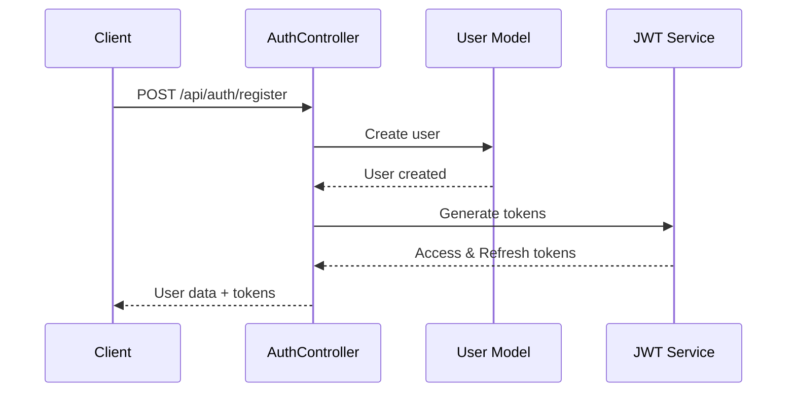
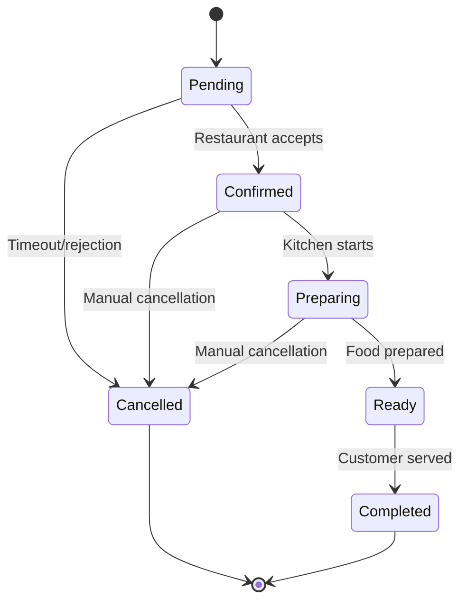
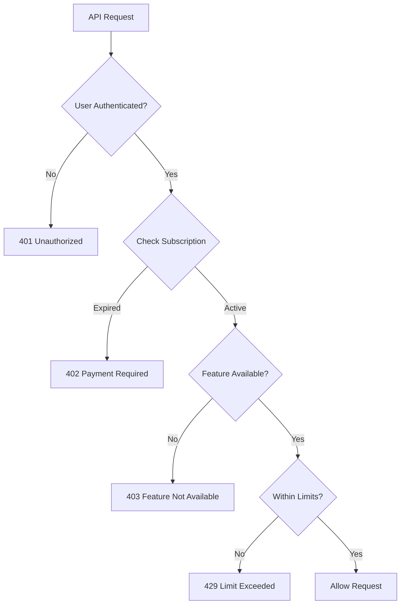
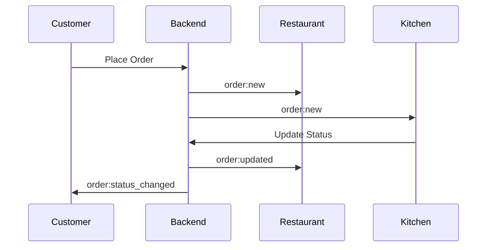
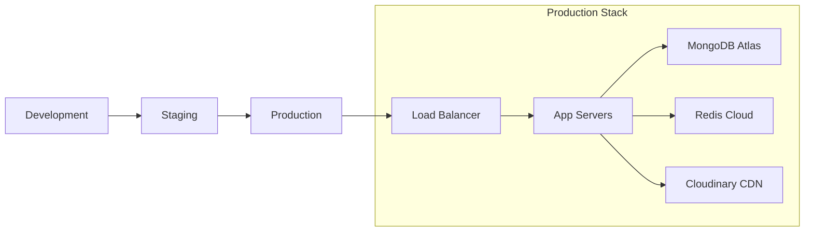

# TableServe Backend Implementation Completion Plan

## Overview

This document completes the remaining implementation tasks for the TableServe backend after the API Endpoints Structure section. It covers controller implementations, authentication middleware, business logic services, real-time features, testing strategy, and deployment configuration.

## Architecture Summary

TableServe is a multi-tenant QR-based restaurant ordering platform with:
- **Node.js + Express.js** backend
- **MongoDB Atlas** for data persistence
- **Redis** for caching and sessions  
- **Socket.io** for real-time updates
- **JWT** authentication with role-based access control
- **Cloudinary** for image management

## Controller Implementation

### Authentication Controller



**Key Features:**
- User registration with role assignment
- Password hashing with bcrypt (12 salt rounds)
- JWT token generation (15min access, 7day refresh)
- Email/phone uniqueness validation
- Comprehensive error handling

### Restaurant Management Controller

**Operations Supported:**
- Create/Read/Update/Delete restaurants
- Table management with QR generation
- Menu category and item CRUD
- Subscription limit enforcement
- Image upload integration

**QR Code Generation:**
- Standard QR codes for basic plans
- Custom QR codes with logo/branding for premium plans
- Table-specific QR codes
- Bulk QR generation for multiple tables

### Order Processing Controller



**Features:**
- Real-time order status updates
- Menu item availability validation
- Modifier price calculations
- Order total computation with tax
- Customer notification system

## Authentication & Authorization Middleware

### JWT Authentication Middleware

```javascript
// Authentication flow
const authMiddleware = async (req, res, next) => {
  // Extract JWT from Authorization header
  // Verify token signature and expiration
  // Load user data and subscription info
  // Attach user to request object
  // Handle token refresh if needed
};
```

### Role-Based Access Control (RBAC)

**Permission Matrix:**

| Feature | Super Admin | Restaurant Owner | Zone Admin | Zone Shop | Zone Vendor |
|---------|-------------|------------------|------------|-----------|-------------|
| User Management | ✅ | ❌ | ❌ | ❌ | ❌ |
| Restaurant CRUD | ✅ | ✅ (own) | ❌ | ❌ | ❌ |
| Zone Management | ✅ | ❌ | ✅ (own) | ❌ | ❌ |
| Menu Management | ✅ | ✅ (own) | ✅ (own zone) | ✅ (own shop) | ✅ (own items) |
| Order Management | ✅ | ✅ (own) | ✅ (own zone) | ✅ (own shop) | ✅ (own items) |
| Analytics | ✅ | ✅ (own) | ✅ (own zone) | ✅ (own shop) | ✅ (own data) |

### Subscription Validation Middleware



## Business Logic Services

### Subscription Management Service

**Features:**
- Plan validation and feature checking
- Usage limit enforcement
- Automatic subscription expiry handling
- Plan upgrade/downgrade workflows
- Usage analytics and reporting

**Subscription Plans Structure:**
```javascript
const subscriptionPlans = {
  restaurant_basic: {
    features: ['crudMenu', 'qrGeneration'],
    limits: { maxTables: 10, maxMenuItems: 50 }
  },
  restaurant_premium: {
    features: ['crudMenu', 'qrGeneration', 'analytics', 'qrCustomization'],
    limits: { maxTables: 50, maxMenuItems: 200 }
  },
  zone_basic: {
    features: ['vendorManagement', 'qrGeneration'],
    limits: { maxShops: 5, maxVendors: 20 }
  }
};
```

### QR Code Generation Service

**Capabilities:**
- Restaurant table QR codes
- Zone/shop QR codes  
- Custom branded QR codes
- Bulk generation
- Dynamic QR data with metadata

**QR Data Structure:**
```javascript
const qrCodeData = {
  type: 'restaurant', // 'restaurant', 'zone', 'shop'
  id: 'restaurantId',
  tableNumber: 5,
  metadata: {
    name: 'Restaurant Name',
    location: 'Address'
  },
  timestamp: Date.now()
};
```

### Order Processing Service

**Order Lifecycle Management:**
- Order validation and creation
- Real-time status updates
- Customer notifications
- Kitchen display integration
- Payment processing hooks

**Price Calculation Engine:**
- Base menu item prices
- Modifier pricing
- Quantity calculations
- Tax computation
- Discount applications

## Real-time Features with Socket.io

### WebSocket Event System



**Event Types:**
- `order:created` - New order placed
- `order:updated` - Status change
- `order:cancelled` - Order cancellation
- `menu:item_updated` - Menu availability change
- `table:status_changed` - Table availability

### Room Management

**Room Structure:**
- `restaurant_{id}` - Restaurant-specific events
- `zone_{id}` - Zone-wide events
- `shop_{id}` - Shop-specific events
- `user_{id}` - User-specific notifications

## Security Implementation

### Input Validation & Sanitization

**Validation Rules:**
- Email format validation
- Phone number format checking
- Password strength requirements
- File upload restrictions
- SQL injection prevention

### Rate Limiting Strategy

```javascript
const rateLimitConfig = {
  auth: { windowMs: 15 * 60 * 1000, max: 5 }, // 5 attempts per 15 min
  api: { windowMs: 15 * 60 * 1000, max: 100 }, // 100 requests per 15 min
  upload: { windowMs: 60 * 1000, max: 10 } // 10 uploads per minute
};
```

### Error Handling & Logging

**Error Categories:**
- Authentication errors (401)
- Authorization errors (403)
- Validation errors (400)
- Resource not found (404)
- Rate limit exceeded (429)
- Server errors (500)

## Testing Strategy

### Unit Testing Structure

```
tests/
├── unit/
│   ├── controllers/
│   │   ├── authController.test.js
│   │   ├── restaurantController.test.js
│   │   └── orderController.test.js
│   ├── services/
│   │   ├── qrCodeService.test.js
│   │   ├── subscriptionService.test.js
│   │   └── orderService.test.js
│   └── middleware/
│       ├── authMiddleware.test.js
│       └── rbacMiddleware.test.js
├── integration/
│   ├── auth-flow.test.js
│   ├── restaurant-management.test.js
│   ├── order-processing.test.js
│   └── subscription-validation.test.js
└── e2e/
    ├── complete-order-flow.test.js
    ├── restaurant-onboarding.test.js
    └── admin-management.test.js
```

### Test Coverage Requirements

**Minimum Coverage Targets:**
- Controllers: 85%
- Services: 90%
- Middleware: 95%
- Models: 80%
- Overall: 85%

### Mock Strategy

**External Services to Mock:**
- MongoDB Atlas connections
- Redis operations
- Cloudinary API calls
- Email service (Nodemailer)
- Socket.io events

## Deployment Architecture

### Environment Configuration



### Docker Configuration

**Multi-stage Build:**
- Builder stage: Install dependencies
- Runtime stage: Copy built app
- Security: Non-root user
- Health checks included

### Environment Variables

**Critical Configuration:**
```bash
# Database
MONGODB_URI=mongodb+srv://...
REDIS_URL=redis://...

# Authentication
JWT_SECRET=32-char-minimum
JWT_REFRESH_SECRET=32-char-minimum

# External Services
CLOUDINARY_CLOUD_NAME=...
CLOUDINARY_API_KEY=...
CLOUDINARY_API_SECRET=...

# Security
BCRYPT_SALT_ROUNDS=12
RATE_LIMIT_WINDOW_MS=900000
CORS_ORIGIN=https://tableserve.com
```

## Implementation Phases

### Phase 1: Controller Implementation (Week 1)
**Tasks:**
- Complete authentication controller
- Implement restaurant management controller
- Build order processing controller
- Add input validation middleware

**Deliverables:**
- Functional CRUD operations
- JWT authentication flow
- Basic order management

### Phase 2: Business Logic Services (Week 2)
**Tasks:**
- Subscription management service
- QR code generation service
- Order processing service
- Email notification service

**Deliverables:**
- Subscription validation system
- QR code generation with customization
- Complete order lifecycle management

### Phase 3: Real-time Features (Week 3)
**Tasks:**
- Socket.io integration
- Real-time order updates
- Live menu availability
- Customer notifications

**Deliverables:**
- WebSocket event system
- Real-time dashboard updates
- Live order tracking

### Phase 4: Security & Testing (Week 4)
**Tasks:**
- Complete test suite implementation
- Security hardening
- Performance optimization
- Documentation completion

**Deliverables:**
- 85%+ test coverage
- Security audit passed
- Performance benchmarks met
- API documentation complete

### Phase 5: Deployment & Monitoring (Week 5)
**Tasks:**
- Production deployment setup
- Monitoring and logging
- CI/CD pipeline
- Load testing

**Deliverables:**
- Production-ready deployment
- Monitoring dashboard
- Automated deployment pipeline
- Performance monitoring

## Performance Considerations

### Database Optimization

**Indexing Strategy:**
- Compound indexes for complex queries
- Text indexes for search functionality
- TTL indexes for session data
- Sparse indexes for optional fields

### Caching Strategy

**Redis Usage:**
- Session storage
- Frequently accessed menu data
- User subscription information
- API response caching

### API Optimization

**Response Optimization:**
- Pagination for large datasets
- Field selection for reduced payload
- Compression middleware
- Response time monitoring

## Monitoring & Maintenance

### Health Checks

**Endpoint Monitoring:**
- `/health` - Basic service health
- `/health/db` - Database connectivity
- `/health/redis` - Cache availability
- `/health/detailed` - Comprehensive status

### Logging Strategy

**Log Categories:**
- Access logs (Morgan)
- Error logs (Winston)
- Security events
- Performance metrics
- User activity audit

### Backup & Recovery

**Data Protection:**
- MongoDB Atlas automatic backups
- Point-in-time recovery
- Configuration backup
- Disaster recovery procedures

## Middleware Implementation Details

### Request Validation Middleware

```javascript
// validationMiddleware.js
const { body, param, query, validationResult } = require('express-validator');

const ValidationRules = {
  // User registration validation
  registerUser: [
    body('email').isEmail().normalizeEmail().withMessage('Valid email required'),
    body('phone').isMobilePhone('any').withMessage('Valid phone number required'),
    body('password').isLength({ min: 8 }).matches(/^(?=.*[a-z])(?=.*[A-Z])(?=.*\d)(?=.*[@$!%*?&])[A-Za-z\d@$!%*?&]/).withMessage('Password must contain uppercase, lowercase, number and special character'),
    body('role').isIn(['restaurant_owner', 'zone_admin', 'zone_shop', 'zone_vendor']).withMessage('Invalid user role'),
    body('name').trim().isLength({ min: 2, max: 50 }).withMessage('Name must be 2-50 characters')
  ],

  // Restaurant creation validation
  createRestaurant: [
    body('name').trim().isLength({ min: 2, max: 100 }).withMessage('Restaurant name required'),
    body('description').optional().trim().isLength({ max: 500 }),
    body('address').trim().isLength({ min: 5, max: 200 }).withMessage('Valid address required'),
    body('phone').isMobilePhone('any').withMessage('Valid phone required'),
    body('email').isEmail().normalizeEmail().withMessage('Valid email required')
  ],

  // Menu item validation
  createMenuItem: [
    body('name').trim().isLength({ min: 2, max: 100 }).withMessage('Item name required'),
    body('description').optional().trim().isLength({ max: 500 }),
    body('price').isFloat({ min: 0 }).withMessage('Valid price required'),
    body('categoryId').isMongoId().withMessage('Valid category ID required'),
    body('modifiers').optional().isArray(),
    body('modifiers.*.name').trim().isLength({ min: 1, max: 50 }),
    body('modifiers.*.required').isBoolean(),
    body('modifiers.*.options').isArray()
  ],

  // Order validation
  createOrder: [
    body('items').isArray({ min: 1 }).withMessage('Order must contain items'),
    body('items.*.menuItemId').isMongoId().withMessage('Valid menu item ID required'),
    body('items.*.quantity').isInt({ min: 1, max: 10 }).withMessage('Valid quantity required'),
    body('customer.name').trim().isLength({ min: 2, max: 50 }).withMessage('Customer name required'),
    body('customer.phone').isMobilePhone('any').withMessage('Valid phone required'),
    body('tableNumber').optional().isInt({ min: 1, max: 999 })
  ]
};

// Generic validation handler
const handleValidation = (req, res, next) => {
  const errors = validationResult(req);
  if (!errors.isEmpty()) {
    return res.status(400).json({
      success: false,
      error: {
        code: 'VALIDATION_ERROR',
        message: 'Input validation failed',
        details: errors.array().map(err => ({
          field: err.path,
          message: err.msg,
          value: err.value
        }))
      }
    });
  }
  next();
};

module.exports = { ValidationRules, handleValidation };
```

### Error Handling Middleware

```javascript
// errorHandler.js
const winston = require('winston');

// Custom error classes
class AppError extends Error {
  constructor(statusCode, code, message, details = null) {
    super(message);
    this.name = 'AppError';
    this.statusCode = statusCode;
    this.code = code;
    this.details = details;
    this.isOperational = true;
    Error.captureStackTrace(this, this.constructor);
  }
}

// Error response formatter
const formatErrorResponse = (error, req) => {
  const response = {
    success: false,
    error: {
      code: error.code || 'INTERNAL_ERROR',
      message: error.message || 'Internal server error',
      timestamp: new Date().toISOString(),
      requestId: req.id || Math.random().toString(36).substr(2, 9)
    }
  };

  // Include details in development
  if (process.env.NODE_ENV === 'development' && error.details) {
    response.error.details = error.details;
  }

  // Include stack trace in development
  if (process.env.NODE_ENV === 'development' && error.stack) {
    response.error.stack = error.stack;
  }

  return response;
};

// Main error handling middleware
const errorHandler = (error, req, res, next) => {
  let statusCode = 500;
  let errorCode = 'INTERNAL_ERROR';
  let message = 'Internal server error';
  let details = null;

  // Handle specific error types
  if (error instanceof AppError) {
    statusCode = error.statusCode;
    errorCode = error.code;
    message = error.message;
    details = error.details;
  } else if (error.name === 'ValidationError') {
    statusCode = 400;
    errorCode = 'VALIDATION_ERROR';
    message = 'Data validation failed';
    details = Object.values(error.errors).map(err => err.message);
  } else if (error.name === 'CastError') {
    statusCode = 400;
    errorCode = 'INVALID_ID';
    message = `Invalid ${error.path}: ${error.value}`;
  } else if (error.code === 11000) {
    statusCode = 409;
    errorCode = 'DUPLICATE_ENTRY';
    message = 'Resource already exists';
    details = Object.keys(error.keyValue);
  } else if (error.name === 'JsonWebTokenError') {
    statusCode = 401;
    errorCode = 'INVALID_TOKEN';
    message = 'Invalid authentication token';
  } else if (error.name === 'TokenExpiredError') {
    statusCode = 401;
    errorCode = 'TOKEN_EXPIRED';
    message = 'Authentication token expired';
  }

  // Log error
  winston.error('API Error', {
    statusCode,
    errorCode,
    message,
    details,
    stack: error.stack,
    url: req.url,
    method: req.method,
    userId: req.user?.id,
    userAgent: req.get('User-Agent'),
    ip: req.ip
  });

  // Send error response
  const formattedError = formatErrorResponse({ statusCode, code: errorCode, message, details }, req);
  res.status(statusCode).json(formattedError);
};

// Async error catcher
const asyncHandler = (fn) => {
  return (req, res, next) => {
    Promise.resolve(fn(req, res, next)).catch(next);
  };
};

// Common error creators
const ErrorTypes = {
  ValidationError: (message, details) => new AppError(400, 'VALIDATION_ERROR', message, details),
  NotFoundError: (resource) => new AppError(404, 'NOT_FOUND', `${resource} not found`),
  UnauthorizedError: (message = 'Unauthorized access') => new AppError(401, 'UNAUTHORIZED', message),
  ForbiddenError: (message = 'Access forbidden') => new AppError(403, 'FORBIDDEN', message),
  ConflictError: (message) => new AppError(409, 'CONFLICT', message),
  RateLimitError: () => new AppError(429, 'RATE_LIMIT_EXCEEDED', 'Too many requests'),
  SubscriptionError: (message) => new AppError(402, 'SUBSCRIPTION_REQUIRED', message),
  PaymentError: (message) => new AppError(402, 'PAYMENT_REQUIRED', message)
};

module.exports = {
  AppError,
  errorHandler,
  asyncHandler,
  ErrorTypes,
  formatErrorResponse
};
```

## Service Layer Implementation

### Email Notification Service

```javascript
// emailService.js
const nodemailer = require('nodemailer');
const winston = require('winston');

class EmailService {
  constructor() {
    this.transporter = nodemailer.createTransporter({
      host: process.env.SMTP_HOST,
      port: process.env.SMTP_PORT,
      secure: process.env.SMTP_SECURE === 'true',
      auth: {
        user: process.env.SMTP_USER,
        pass: process.env.SMTP_PASS
      }
    });
  }

  // Send email verification
  async sendEmailVerification(user, verificationToken) {
    const verificationUrl = `${process.env.FRONTEND_URL}/verify-email?token=${verificationToken}`;
    
    const mailOptions = {
      from: process.env.EMAIL_FROM,
      to: user.email,
      subject: 'Verify Your TableServe Account',
      html: `
        <div style="font-family: Arial, sans-serif; max-width: 600px; margin: 0 auto;">
          <h2>Welcome to TableServe!</h2>
          <p>Please verify your email address by clicking the button below:</p>
          <a href="${verificationUrl}" style="background-color: #007bff; color: white; padding: 12px 24px; text-decoration: none; border-radius: 4px; display: inline-block;">Verify Email</a>
          <p>If you didn't create this account, you can safely ignore this email.</p>
          <p>This link will expire in 24 hours.</p>
        </div>
      `
    };

    try {
      await this.transporter.sendMail(mailOptions);
      winston.info(`Email verification sent to ${user.email}`);
    } catch (error) {
      winston.error('Failed to send email verification', { error: error.message, email: user.email });
      throw error;
    }
  }

  // Send order confirmation
  async sendOrderConfirmation(order, customer) {
    const mailOptions = {
      from: process.env.EMAIL_FROM,
      to: customer.email,
      subject: `Order Confirmation - ${order.orderNumber}`,
      html: `
        <div style="font-family: Arial, sans-serif; max-width: 600px; margin: 0 auto;">
          <h2>Order Confirmed!</h2>
          <p>Your order has been confirmed and is being prepared.</p>
          <div style="background-color: #f8f9fa; padding: 16px; border-radius: 4px; margin: 16px 0;">
            <h3>Order Details</h3>
            <p><strong>Order Number:</strong> ${order.orderNumber}</p>
            <p><strong>Estimated Time:</strong> ${order.deliveryInfo.estimatedTime} minutes</p>
            <p><strong>Total Amount:</strong> $${order.finalAmount.toFixed(2)}</p>
          </div>
          <h4>Items Ordered:</h4>
          <ul>
            ${order.items.map(item => `
              <li>${item.name} x${item.quantity} - $${(item.price * item.quantity).toFixed(2)}</li>
            `).join('')}
          </ul>
          <p>We'll notify you when your order is ready!</p>
        </div>
      `
    };

    try {
      await this.transporter.sendMail(mailOptions);
      winston.info(`Order confirmation sent for ${order.orderNumber}`);
    } catch (error) {
      winston.error('Failed to send order confirmation', { error: error.message, orderNumber: order.orderNumber });
    }
  }

  // Send order status update
  async sendOrderStatusUpdate(order, customer, newStatus) {
    const statusMessages = {
      confirmed: 'Your order has been confirmed and is being prepared.',
      preparing: 'Your order is now being prepared by the kitchen.',
      ready: 'Your order is ready for pickup!',
      completed: 'Your order has been completed. Thank you for choosing us!'
    };

    const mailOptions = {
      from: process.env.EMAIL_FROM,
      to: customer.email,
      subject: `Order Update - ${order.orderNumber}`,
      html: `
        <div style="font-family: Arial, sans-serif; max-width: 600px; margin: 0 auto;">
          <h2>Order Status Update</h2>
          <p>${statusMessages[newStatus]}</p>
          <div style="background-color: #f8f9fa; padding: 16px; border-radius: 4px; margin: 16px 0;">
            <p><strong>Order Number:</strong> ${order.orderNumber}</p>
            <p><strong>Status:</strong> ${newStatus.toUpperCase()}</p>
          </div>
        </div>
      `
    };

    try {
      await this.transporter.sendMail(mailOptions);
      winston.info(`Order status update sent for ${order.orderNumber}`);
    } catch (error) {
      winston.error('Failed to send order status update', { error: error.message, orderNumber: order.orderNumber });
    }
  }
}

module.exports = new EmailService();
```

### File Upload Service

```javascript
// uploadService.js
const multer = require('multer');
const cloudinary = require('cloudinary').v2;
const { ErrorTypes } = require('../middleware/errorHandler');

// Configure Cloudinary
cloudinary.config({
  cloud_name: process.env.CLOUDINARY_CLOUD_NAME,
  api_key: process.env.CLOUDINARY_API_KEY,
  api_secret: process.env.CLOUDINARY_API_SECRET
});

// Multer configuration for memory storage
const storage = multer.memoryStorage();

// File filter for images
const fileFilter = (req, file, cb) => {
  const allowedTypes = ['image/jpeg', 'image/png', 'image/gif', 'image/webp'];
  
  if (allowedTypes.includes(file.mimetype)) {
    cb(null, true);
  } else {
    cb(ErrorTypes.ValidationError('Invalid file type. Only JPEG, PNG, GIF, and WebP are allowed.'), false);
  }
};

// Multer upload configuration
const upload = multer({
  storage: storage,
  fileFilter: fileFilter,
  limits: {
    fileSize: parseInt(process.env.MAX_FILE_SIZE) || 5 * 1024 * 1024, // 5MB default
    files: 5 // Maximum 5 files per request
  }
});

class UploadService {
  // Upload single image to Cloudinary
  static async uploadImage(buffer, options = {}) {
    try {
      const uploadOptions = {
        folder: options.folder || 'tableserve',
        transformation: [
          { width: 800, height: 600, crop: 'limit' },
          { quality: 'auto' },
          { format: 'auto' }
        ],
        ...options
      };

      return new Promise((resolve, reject) => {
        const uploadStream = cloudinary.uploader.upload_stream(
          uploadOptions,
          (error, result) => {
            if (error) {
              reject(error);
            } else {
              resolve({
                url: result.secure_url,
                publicId: result.public_id,
                width: result.width,
                height: result.height,
                format: result.format,
                bytes: result.bytes
              });
            }
          }
        );
        uploadStream.end(buffer);
      });
    } catch (error) {
      throw ErrorTypes.ValidationError('Image upload failed', error.message);
    }
  }

  // Upload multiple images
  static async uploadMultipleImages(files, options = {}) {
    try {
      const uploadPromises = files.map(file => 
        this.uploadImage(file.buffer, {
          ...options,
          original_filename: file.originalname
        })
      );

      return await Promise.all(uploadPromises);
    } catch (error) {
      throw ErrorTypes.ValidationError('Multiple image upload failed', error.message);
    }
  }

  // Delete image from Cloudinary
  static async deleteImage(publicId) {
    try {
      const result = await cloudinary.uploader.destroy(publicId);
      return result.result === 'ok';
    } catch (error) {
      throw ErrorTypes.ValidationError('Image deletion failed', error.message);
    }
  }

  // Generate optimized image URL
  static generateOptimizedUrl(publicId, transformations = {}) {
    const defaultTransformations = {
      quality: 'auto',
      format: 'auto'
    };

    return cloudinary.url(publicId, {
      ...defaultTransformations,
      ...transformations
    });
  }
}

// Middleware for handling file uploads
const uploadMiddleware = {
  single: (fieldName) => upload.single(fieldName),
  multiple: (fieldName, maxCount = 5) => upload.array(fieldName, maxCount),
  fields: (fields) => upload.fields(fields)
};

module.exports = {
  UploadService,
  uploadMiddleware
};
```

## Database Configuration & Models

### Mongoose Models with Validation

```javascript
// models/User.js
const mongoose = require('mongoose');
const bcrypt = require('bcryptjs');

const userSchema = new mongoose.Schema({
  email: {
    type: String,
    required: [true, 'Email is required'],
    unique: true,
    lowercase: true,
    validate: {
      validator: function(email) {
        return /^[^\s@]+@[^\s@]+\.[^\s@]+$/.test(email);
      },
      message: 'Please provide a valid email address'
    }
  },
  phone: {
    type: String,
    required: [true, 'Phone number is required'],
    unique: true,
    validate: {
      validator: function(phone) {
        return /^[+]?[1-9]\d{1,14}$/.test(phone);
      },
      message: 'Please provide a valid phone number'
    }
  },
  passwordHash: {
    type: String,
    required: [true, 'Password is required'],
    minlength: [8, 'Password must be at least 8 characters']
  },
  role: {
    type: String,
    enum: {
      values: ['admin', 'restaurant_owner', 'zone_admin', 'zone_shop', 'zone_vendor'],
      message: 'Invalid user role'
    },
    required: [true, 'User role is required']
  },
  emailVerified: {
    type: Boolean,
    default: false
  },
  phoneVerified: {
    type: Boolean,
    default: false
  },
  profile: {
    name: {
      type: String,
      required: [true, 'Name is required'],
      trim: true,
      maxlength: [50, 'Name cannot exceed 50 characters']
    },
    avatar: {
      type: String,
      default: null
    },
    address: {
      type: String,
      maxlength: [200, 'Address cannot exceed 200 characters']
    },
    settings: {
      type: mongoose.Schema.Types.Mixed,
      default: {}
    }
  },
  lastLogin: {
    type: Date,
    default: null
  },
  isActive: {
    type: Boolean,
    default: true
  }
}, {
  timestamps: true,
  toJSON: {
    transform: function(doc, ret) {
      delete ret.passwordHash;
      delete ret.__v;
      return ret;
    }
  }
});

// Indexes
userSchema.index({ email: 1 });
userSchema.index({ phone: 1 });
userSchema.index({ role: 1 });
userSchema.index({ 'profile.name': 'text' });

// Virtual for subscription
userSchema.virtual('subscription', {
  ref: 'Subscription',
  localField: '_id',
  foreignField: 'userId',
  justOne: true
});

// Methods
userSchema.methods.comparePassword = async function(candidatePassword) {
  return await bcrypt.compare(candidatePassword, this.passwordHash);
};

userSchema.methods.updateLastLogin = function() {
  this.lastLogin = new Date();
  return this.save();
};

module.exports = mongoose.model('User', userSchema);
```

## API Documentation Structure

### OpenAPI/Swagger Configuration

```javascript
// swagger.js
const swaggerJsdoc = require('swagger-jsdoc');
const swaggerUi = require('swagger-ui-express');

const options = {
  definition: {
    openapi: '3.0.0',
    info: {
      title: 'TableServe API',
      version: '1.0.0',
      description: 'QR-based restaurant ordering platform API',
      contact: {
        name: 'TableServe Support',
        email: 'support@tableserve.com'
      }
    },
    servers: [
      {
        url: process.env.API_BASE_URL || 'http://localhost:3001',
        description: 'Development server'
      }
    ],
    components: {
      securitySchemes: {
        bearerAuth: {
          type: 'http',
          scheme: 'bearer',
          bearerFormat: 'JWT'
        }
      },
      schemas: {
        User: {
          type: 'object',
          properties: {
            id: { type: 'string' },
            email: { type: 'string', format: 'email' },
            phone: { type: 'string' },
            role: { 
              type: 'string', 
              enum: ['admin', 'restaurant_owner', 'zone_admin', 'zone_shop', 'zone_vendor'] 
            },
            profile: {
              type: 'object',
              properties: {
                name: { type: 'string' },
                avatar: { type: 'string' },
                address: { type: 'string' }
              }
            }
          }
        },
        Restaurant: {
          type: 'object',
          properties: {
            id: { type: 'string' },
            name: { type: 'string' },
            description: { type: 'string' },
            address: { type: 'string' },
            phone: { type: 'string' },
            email: { type: 'string' },
            active: { type: 'boolean' }
          }
        },
        Order: {
          type: 'object',
          properties: {
            id: { type: 'string' },
            orderNumber: { type: 'string' },
            status: { 
              type: 'string',
              enum: ['pending', 'confirmed', 'preparing', 'ready', 'completed', 'cancelled']
            },
            totalAmount: { type: 'number' },
            items: {
              type: 'array',
              items: {
                type: 'object',
                properties: {
                  name: { type: 'string' },
                  quantity: { type: 'integer' },
                  price: { type: 'number' }
                }
              }
            }
          }
        },
        Error: {
          type: 'object',
          properties: {
            success: { type: 'boolean', example: false },
            error: {
              type: 'object',
              properties: {
                code: { type: 'string' },
                message: { type: 'string' },
                details: { type: 'array' }
              }
            }
          }
        }
      }
    }
  },
  apis: ['./src/routes/*.js', './src/controllers/*.js']
};

const specs = swaggerJsdoc(options);

module.exports = {
  serve: swaggerUi.serve,
  setup: swaggerUi.setup(specs, {
    customCss: '.swagger-ui .topbar { display: none }',
    customSiteTitle: 'TableServe API Documentation'
  })
};
```

This comprehensive backend implementation plan completes all remaining tasks needed to build a production-ready TableServe backend system with robust authentication, real-time features, and scalable architecture.