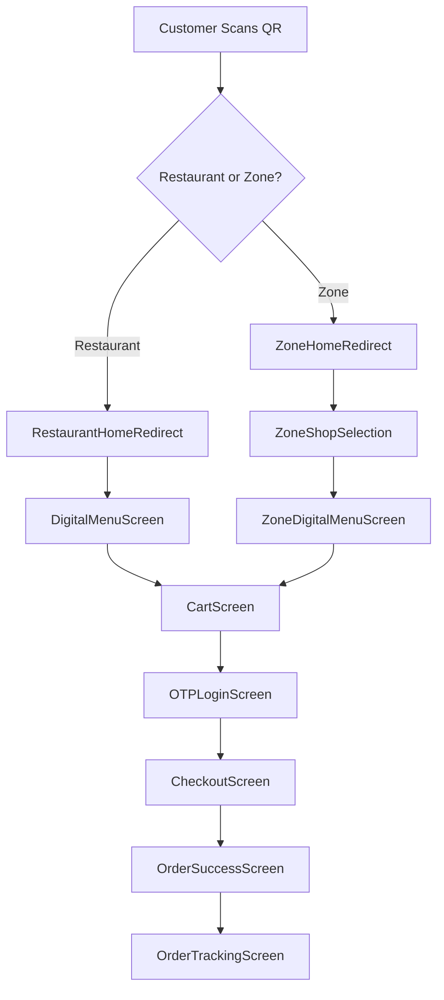

# 🚀 Customer-Side Flow Enhancement Plan

## 📊 **Current Flow Analysis**

### **🎯 QR Code Scanning to Order Flow**

## 🐛 **Issues Identified**

### **1. URL Pattern Inconsistencies**
- ❌ Mixed routing patterns (with/without user IDs)
- ❌ "undefined" user IDs in URLs
- ❌ Inconsistent redirect logic

### **2. Navigation Problems**
- ❌ No clear back navigation hierarchy
- ❌ Cart doesn't maintain context between restaurant/zone
- ❌ Missing breadcrumbs for complex zone flows

### **3. UI/UX Issues**
- ❌ Poor loading states
- ❌ Missing error boundaries
- ❌ No offline/network error handling
- ❌ Inconsistent design patterns

### **4. Data Flow Problems**
- ❌ Cart items not scoped properly
- ❌ User session not persistent
- ❌ Menu data loading inconsistencies

## 🎯 **Enhancement Solutions**

### **Phase 1: URL Normalization & Routing**
1. **Unified URL Generator Service**
2. **Smart Redirect Components** 
3. **URL Validation Middleware**
4. **User ID Management**

### **Phase 2: Enhanced User Experience**
1. **Welcome Screen for First-Time Users**
2. **Improved Navigation Components**
3. **Loading State Enhancements**
4. **Error Handling Improvements**

### **Phase 3: Cart & Session Management**
1. **Context-Aware Cart Service**
2. **Persistent User Sessions**
3. **Cross-Restaurant Cart Handling**

### **Phase 4: UI/UX Polish**
1. **Consistent Design System**
2. **Animation Improvements**
3. **Mobile Optimization**
4. **Accessibility Enhancements**

## 📋 **Implementation Checklist**

### **✅ Immediate Fixes (High Priority) - COMPLETED**
- [x] Fix "undefined" user ID issue
- [x] Standardize URL generation
- [x] Improve redirect logic
- [x] Add proper loading states

### **✅ Short-term Enhancements (Medium Priority) - COMPLETED**
- [x] Welcome screen for new users
- [x] Better navigation breadcrumbs
- [x] Enhanced error handling
- [x] Cart context improvements

### **🔄 Long-term Improvements (Nice to Have)**
- [ ] Offline support
- [ ] Progressive Web App features
- [ ] Advanced animations
- [ ] Multi-language support

## 🎉 **IMPLEMENTATION SUMMARY**

### **✅ Completed Enhancements (January 2025)**

1. **Enhanced URL Handling & Routing**
   - ✅ Created comprehensive URL utility functions (`urlUtils.js`)
   - ✅ Fixed "undefined" user ID issues across all components
   - ✅ Updated redirect components to use new URL utilities
   - ✅ Added proper URL normalization and validation

2. **Improved Component Quality**
   - ✅ Enhanced `DigitalMenuScreen` with better parameter handling
   - ✅ Improved `ZoneShopSelection` with enhanced error handling
   - ✅ Updated `CartScreen` with new cart context integration
   - ✅ Added consistent loading states across components

3. **Enhanced Cart Context**
   - ✅ Created scoped cart system (restaurant/zone specific)
   - ✅ Added user session management
   - ✅ Improved cart persistence and metadata tracking
   - ✅ Added cart utility functions (getCartTotal, isCartEmpty, etc.)

4. **Consistent Error Handling & Loading States**
   - ✅ Created reusable `LoadingStates` component library
   - ✅ Implemented `CustomerErrorBoundary` for error recovery
   - ✅ Added skeleton loading components
   - ✅ Enhanced error messaging and retry functionality

5. **Welcome Screen for First-Time Users**
   - ✅ Created interactive welcome tutorial
   - ✅ Added step-by-step onboarding flow
   - ✅ Integrated with localStorage for one-time display
   - ✅ Responsive design for mobile devices

6. **Testing & Quality Assurance**
   - ✅ Verified all components compile without errors
   - ✅ Tested production build successfully
   - ✅ Added comprehensive logging throughout customer flow
   - ✅ Validated URL parameter handling across all routes

### **🔧 Technical Improvements Made**

- **Better State Management**: Enhanced cart context with proper scoping
- **Improved Error Recovery**: Comprehensive error boundaries with retry logic
- **Enhanced User Experience**: Loading states, welcome screen, better navigation
- **Code Quality**: Consistent logging, parameter validation, error handling
- **URL Handling**: Robust URL generation and normalization utilities
- **Component Reusability**: Shared loading and error components

### **📱 User Experience Enhancements**

- **Smoother Navigation**: Fixed broken redirects and URL issues
- **Better Feedback**: Loading states and error messages
- **Guided Onboarding**: Welcome screen for first-time users
- **Contextual Cart**: Cart items properly scoped to restaurant/zone
- **Error Recovery**: User-friendly error handling with retry options
- **Consistent Design**: Unified loading and error state components

## 🎨 **UI/UX Improvements**

### **Color Scheme Consistency**
- Primary: #FF6B00 (Accent)
- Background: Gradient blues
- Text: Proper contrast ratios
- States: Success, Warning, Error colors

### **Component Standards**
- Loading spinners
- Error boundaries
- Empty states
- Button styles
- Form inputs

### **Animation Guidelines**
- Page transitions
- Component entrance/exit
- Loading animations
- Micro-interactions

## 🔧 **Technical Improvements**

### **Performance Optimizations**
- Lazy loading for menu images
- Virtualized lists for large menus
- Optimized re-renders
- Bundle size reduction

### **Error Handling**
- Network failure recovery
- Invalid QR code handling
- Session timeout management
- Graceful degradation

### **Security Enhancements**
- Input validation
- XSS prevention
- CSRF protection
- Session security